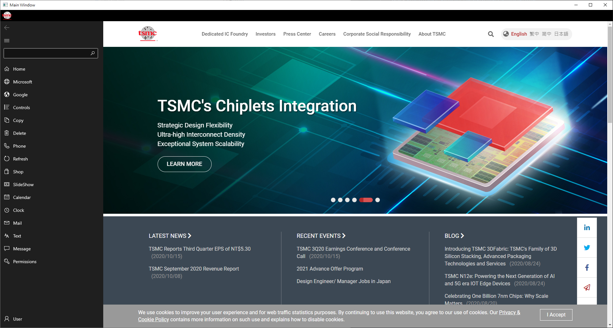

# WinUI3 



Shows WinUI3.0 with WebView2 and NavigationView controls. This App is a template interface for Windows Desktop WPF. 


# OAuth2

It also has a OAuth2 implementation for third-party authentication with Azure Active Directory. To use this favor, you should register your own App in [Azure Active Directory](https://azure.microsoft.com/zh-tw/services/active-directory/) and mark the clientID and Tenant in your code. 

```csharp 
private static string ClientId = "0708f526-5d99-432d-ace8-be7e6bbd963f";
private static string Tenant = "223bcf98-a4ce-4db8-998b-30fb36bd589a";
```

## Related topics
[Windows UI Library 3 Preview 2 (July 2020)] (https://docs.microsoft.com/en-us/windows/apps/winui/winui3)                                
[Windows UI Library 2.x (WinUI)](https://docs.microsoft.com/uwp/toolkits/winui/)                                      
[Azure AD Authentication in WPF Application using MSAL]  (https://manojchoudhari.wordpress.com/2020/05/29/azure-ad-authentication-in-wpf-application-using-msal/)              
[Active-directory-scenario-desktop-acquire-token](https://docs.microsoft.com/zh-tw/azure/active-directory/develop/scenario-desktop-acquire-token?tabs=dotnet)

## Related samples
[WinUI3 XAML Controls Gallery](https://github.com/microsoft/Xaml-Controls-Gallery/tree/winui3preview)                             
[Quickstart: Acquire a token and call Microsoft Graph API from a Windows desktop app](https://docs.microsoft.com/zh-tw/azure/active-directory/develop/quickstart-v2-windows-desktop)  
[RSS reader sample](https://github.com/Microsoft/Windows-appsample-rssreader)  
[Lunch Scheduler app sample](https://github.com/Microsoft/Windows-appsample-lunch-scheduler)  
[Customers Orders Database sample](https://github.com/Microsoft/Windows-appsample-customers-orders-database)  
[Universal Windows Platform (UWP) Samples](https://github.com/Microsoft/Windows-universal-samples/tree/dev)
